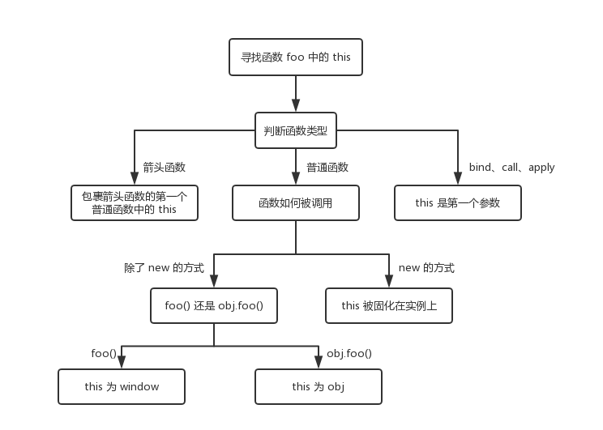

## 核心定义

先记住一句面试级定义：

> JavaScript 中 this 的指向不是在定义时决定的，而是在函数调用时决定的。

也就是说：

> 谁调用函数，this 就指向谁但有 几种特殊规则会改变 this

## this 的五种情况（面试核心）

优先级：

> 默认绑定 < 隐式绑定 < 显式绑定 < new 绑定 < 箭头函数（特殊）

### 1. 默认绑定

函数单独调用时，this 指向全局对象（浏览器中是 window，Node.js 中是 global,严格模式下是 undefined）

```js
var name = 'global name'

function foo() {
  console.log(this.name)
}

foo() // 'global name'
```

### 2. 隐式绑定（对象调用）

如果函数 作为对象的方法调用：this 指向 调用它的对象

```js
var obj = {
  name: 'obj name',
  foo: foo
}

obj.foo() // 'obj name'
```

### 3. 显式绑定（call / apply / bind）

JS 提供三个 API 强制改变 this

| 方法  | 作用       |
| ----- | ---------- |
| call  | 立即执行   |
| apply | 立即执行   |
| bind  | 返回新函数 |

示例：

```js
obj.foo.apply(obj1)
```

等价于：

```js
foo.call(obj1)
```

此时：

```js
this = obj1
```

输出：

```js
obj1 name
```

注意一个面试细节：

如果传入：

```js
foo.call(null)
```

非严格模式：

```js
this = window
```

### 4. new 绑定（优先级最高）

当函数被 new 调用：

```js
new Person()
```

会发生四件事：

第一步

创建新对象

```js
var obj = {}
```

第二步

新对象继承原型

```js
obj.__proto__ = Person.prototype
```

第三步

this 指向新对象

```js
this = obj
```

第四步

返回对象

所以：

```js
var p1 = new Person('p1 name')
```

执行：

```js
this.name = name
```

等价：

```js
p1.name = 'p1 name'
```

然后：

```js
p1.getName()
```

输出：

> p1 name

### 5. 箭头函数（特殊规则）

箭头函数 没有自己的 this

它会：

> 继承外层最近普通函数的 this

```js
var obj = {
  name: 'obj',
  foo: function () {
    const bar = () => {
      console.log(this.name)
    }
    bar()
  }
}

obj.foo() // 'obj'
```

### 总结

```js
var name = 'global name'
var foo = function () {
  console.log(this.name)
}
var Person = function (name) {
  this.name = name
}
Person.prototype.getName = function () {
  console.log(this.name)
}
var obj = {
  name: 'obj name',
  foo: foo
}
var obj1 = {
  name: 'obj1 name'
}

// 独立函数调用，输出：global name
foo()
// 对象调用，输出：obj name
obj.foo()
// apply()，输出：obj1 name
obj.foo.apply(obj1)
// new 构造函数调用，输出：p1 name
var p1 = new Person('p1 name')
p1.getName()
```

### 怎么理解 JavaScript 的 this？

标准回答结构：

1. this 是函数执行时的上下文
2. 它的指向由调用方式决定
3. 常见规则有默认绑定、隐式绑定、显式绑定、new绑定
4. 箭头函数没有自己的 this

this 是 JavaScript 函数执行时的上下文对象，它的指向由函数调用方式决定，而不是函数定义位置决定。常见的绑定规则包括：1 默认绑定（独立调用）2 隐式绑定（对象调用）3 显式绑定（call
apply bind）4 new 绑定 5 箭头函数继承外层 this 6 new 绑定的优先级最高

### this指向的本质

- 比如箭头函数，内外this环境保持一致，是因为想让函数在执行过程中可以直接调用外层函数的 this,这样就可以避免在箭头函数中使用 this 时出现的问题。
- bind等三个函数，是为了指定让某个对象可以复用一整套方法（工具）


