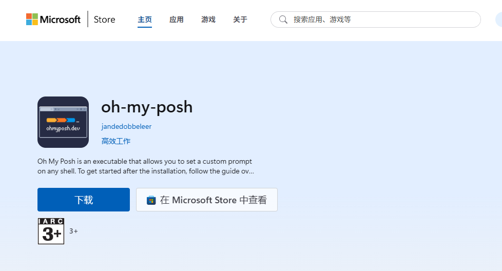
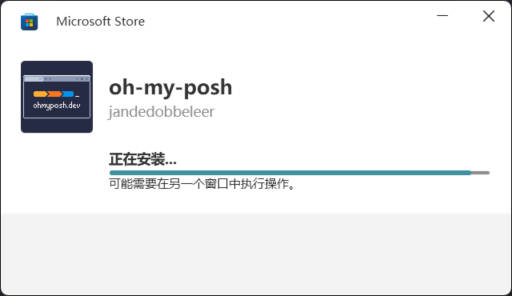

## ohmyposh 官网文档

[ohmyposh](https://ohmyposh.dev/)


## 1. 安装 ohmyposh



## 2. 配置 ohmyposh

打开PowerShell提示符，并执行以下命令：

1. 先验证 winget 是否可用（避免命令执行失败）：

    ```powershell
    # 检查 winget 是否安装并能正常运行
    winget --version
    ```

    如果提示 “找不到命令”，说明未安装 winget，需先安装：
    Windows 11 通常自带 winget，Windows 10 需从 Microsoft Store 安装 “应用安装程序”（App Installer）。

    ```powershell
    winget upgrade JanDeDobbeleer.OhMyPosh --source winget
    ```

  <未完待续>

## 最终配置结果
